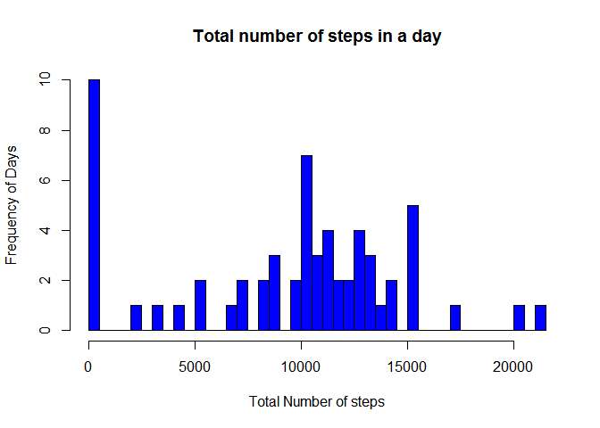
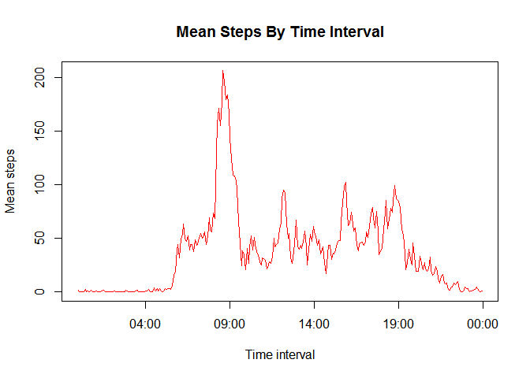
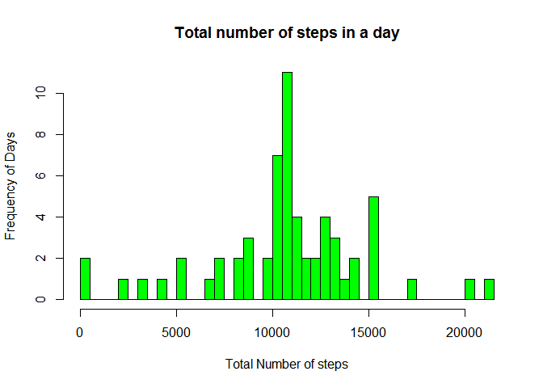
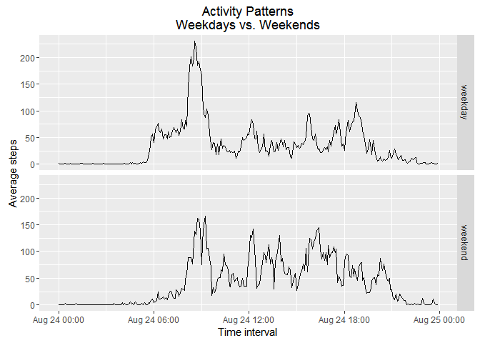

---------------------
title: ""Reproducible Research: Peer Assessment 1"
author: "Kenneth Foster Amponsah"
date: "24 August 2016"
output: html_document
keep_md: true
---------------------


```r
library(knitr)
opts_chunk$set(echo = TRUE, warning = FALSE)
```


#Loading and preprocessing the data


```r
act<-read.csv("activity.csv")
```
We will pre-process the file as follows:
Convert the character date column to a POSIX date in YYYY-MM-DD format.
Convert the integer interval column to a new POSIX time column in HH:MM format.

```r
act$date<-as.POSIXct(strptime(act$date, format = "%Y-%m-%d",tz=""))
```
first convert integer time to character and pad with leading zeros...


```r
act$time <- sprintf("%04d", act$interval)
act$time<- as.POSIXct(act$time, "%H%M", tz="")
```


# What is mean total number of steps taken per day?
To answer this question, we'll use aggregate() to create a new data frame.  The data frame will contain two columns: date and total steps for each date.
We will ignore the missing values in the data set.


```r
sum.steps<-aggregate(list(total_steps=act$steps),by=list(date=act$date),sum, na.rm = TRUE)
```
Histogram showing the daily total number of steps


```r
hist(sum.steps$total_steps, breaks = 61, main= "Total number of steps in a day", col = "blue", xlab ="Total Number of steps", ylab = "Frequency of Days" )
```

<!-- -->

calculating the mean and median number of steps per day


```r
mean(sum.steps$total_steps, na.rm = TRUE)
```

```
## [1] 9354.23
```

```r
median(sum.steps$total_steps, na.rm = TRUE)
```

```
## [1] 10395
```

#What is the average daily activity pattern?
First we'll use the aggregate() function to obtain the average number of steps for each time interval.  With the result, we can draw a time series plot showing time interval on the x-axis and mean number of steps for the time interval on the y-axis.


```r
mean.steps.time<-aggregate(list(mean_steps=act$steps),by=list(time=act$time),mean, na.rm = TRUE)
plot(mean.steps.time$time,mean.steps.time$mean_steps, data=mean.steps.time, type = "l", xlab="Time interval",ylab="Mean steps",
         main="Mean Steps By Time Interval", col="red",lwd=0.5, warning= FALSE)
```

<!-- -->

Next, we determine the time interval with the maximum average number of steps.


```r
mean.steps.time[which.max(mean.steps.time$mean_steps),]
```

```
##                    time mean_steps
## 104 2016-08-24 08:35:00   206.1698
```

# Imputing missing values
First, obtain a count of missing values in the steps column.


```r
sum(is.na(act[,"steps"]))
```

```
## [1] 2304
```

For an imputed value, use the average number of steps for the time interval, obtained above.  To do this, we'll merge the original data frame with the data frame containing average steps by interval to form a third, new data frame.  We'll impute values for the NA's in the new data frame.  

 "join" the two data frames using merge()

```r
act_imputed <- merge(act,mean.steps.time,by="time")
```

 correct the NA steps with average steps for the interval


```r
act_imputed <- within(act_imputed, steps <- ifelse(is.na(act_imputed$steps), act_imputed$mean_steps, act_imputed$steps))
```

# What is mean total number of steps taken per day?
To answer this question, we'll use aggregate() to create a new data frame.  The data frame will contain two columns: date and total steps for each date.
We will ignore the missing values in the data set.


```r
sum.steps_imputed<-aggregate(list(total_steps=act_imputed$steps),by=list(date=act_imputed$date),sum)
```

Histogram showing the daily total number of steps


```r
hist(sum.steps_imputed$total_steps, breaks = 61, main= "Total number of steps in a day", col = "green", xlab ="Total Number of steps", ylab = "Frequency of Days" )
```

<!-- -->

calculating the mean and median number of steps per day


```r
mean(sum.steps_imputed$total_steps)
```

```
## [1] 10766.19
```

```r
median(sum.steps_imputed$total_steps)
```

```
## [1] 10766.19
```

#What is the average daily activity pattern?
First we'll use the aggregate() function to obtain the average number of steps for each time interval.  With the result, we can draw a time series plot showing time interval on the x-axis and mean number of steps for the time interval on the y-axis.


```r
mean.steps.time_imputed<-aggregate(list(mean_steps=act_imputed$steps),by=list(time=act_imputed$time),mean)
plot(mean.steps.time_imputed$time,mean.steps.time_imputed$mean_steps, data=mean.steps.time_imputed, type = "l", xlab="Time interval",ylab="Mean steps",
     main="Mean Steps By Time Interval", col="purple",lwd=0.5, warning= FALSE)
```

<!-- -->

Next, we determine the time interval with the maximum average number of steps.


```r
mean.steps.time_imputed[which.max(mean.steps.time_imputed$mean_steps),]
```

```
##                    time mean_steps
## 104 2016-08-24 08:35:00   206.1698
```

The mean and median total number of steps are now equal to one another (!!!) and higher with the imputed values.  Estimates of the total daily number of steps are higher with the imputed values.  

# Are there differences in activity patterns between weekdays and weekends?
 Add a factor called weekend_indicator with two levels to the data set indicating whether the date is a weekday or a weekend.
 
  first add a character column for day of the week

```r
 act_imputed$weekday  <- weekdays(act_imputed$date)
```
  now populate a new factor column using day of the week and a simple function
 

```r
 act_imputed$weekend_indicator <- as.factor(apply(act_imputed["weekday"], 1, function(x) {
  switch(x,
          "Sunday" = "weekend",
          "Saturday" = "weekend",
          "weekday")
 }))
 # confirm that we have the character and factor types we expect
 str(act_imputed)
```

```
## 'data.frame':	17568 obs. of  7 variables:
##  $ time             : POSIXct, format: "2016-08-24 00:00:00" "2016-08-24 00:00:00" ...
##  $ steps            : num  1.72 0 0 0 0 ...
##  $ date             : POSIXct, format: "2012-10-01" "2012-11-23" ...
##  $ interval         : int  0 0 0 0 0 0 0 0 0 0 ...
##  $ mean_steps       : num  1.72 1.72 1.72 1.72 1.72 ...
##  $ weekday          : chr  "Monday" "Friday" "Sunday" "Tuesday" ...
##  $ weekend_indicator: Factor w/ 2 levels "weekday","weekend": 1 1 2 1 2 1 2 1 1 2 ...
```
 Now draw a panel plot using ggplot2, comparing activity patterns on weekdays and weekends.

```r
 mean.steps.time_weekend <- aggregate(list(average_steps = act_imputed$steps),
                                            by=list(time       = act_imputed$time,
                                                    daytype    = act_imputed$weekend_indicator),
                                            FUN=mean)
 library(ggplot2)
 qplot(x = time,
       y = average_steps,
       geom="path",
       data = mean.steps.time_weekend, 
       xlab="Time interval",
       ylab="Average steps",
       main="Activity Patterns\nWeekdays vs. Weekends",
       facets = daytype ~ .)
```

<!-- -->
 
 The histograms will be a little easier to interpret if accompanied by summary statistics, broken out by weekday / weekend.  On average, steps are higher on the weekend, although the maximum for steps is highest on weekday mornings at 8:35.  Weekend activity is more variable (s.d. of steps is higher on the weekend).     

```r
 library(psych)
```

```
## 
## Attaching package: 'psych'
```

```
## The following objects are masked from 'package:ggplot2':
## 
##     %+%, alpha
```

```r
 by(mean.steps.time_weekend,
    mean.steps.time_weekend$daytype,
    FUN=describe)
```

```
## mean.steps.time_weekend$daytype: weekday
##               vars   n  mean    sd median trimmed   mad min    max  range
## time*            1 288   NaN    NA     NA     NaN    NA Inf   -Inf   -Inf
## daytype*         2 288  1.00  0.00    1.0    1.00  0.00   1   1.00   0.00
## average_steps    3 288 35.61 41.62   25.8   28.33 35.23   0 230.38 230.38
##               skew kurtosis   se
## time*           NA       NA   NA
## daytype*       NaN      NaN 0.00
## average_steps 2.09     5.49 2.45
## -------------------------------------------------------- 
## mean.steps.time_weekend$daytype: weekend
##               vars   n  mean    sd median trimmed   mad min    max  range
## time*            1 288   NaN    NA     NA     NaN    NA Inf   -Inf   -Inf
## daytype*         2 288  2.00  0.00   2.00    2.00  0.00   2   2.00   0.00
## average_steps    3 288 42.37 42.54  32.34   37.11 46.91   0 166.64 166.64
##               skew kurtosis   se
## time*           NA       NA   NA
## daytype*       NaN      NaN 0.00
## average_steps 0.79    -0.34 2.51
```
